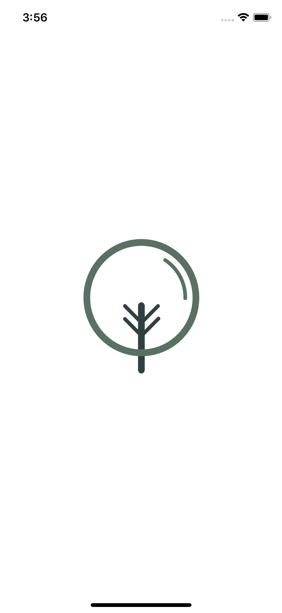
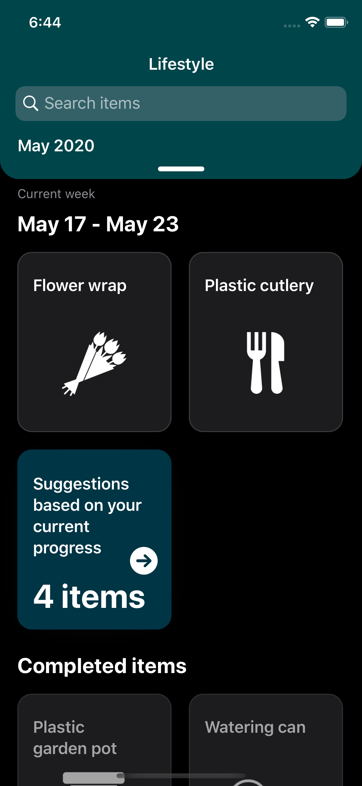

# Useful: zero-waste lifestyle partner

The current application is the implementation of the design prepared for the university project. The interactive design can be accessed by clicking on the Invision logo.

## Purpose

The purpose of the application - to create a tool for people that would help to reduce waste. In the full design version, the application has four tabs: _challanges_, _activities_, _lifestyle_ and _personal impact_. Each of them has a specific purpose in helping to reach a zero-waste lifestyle.

## Demo

The prepared demo contains the implementation of the main screen of _lifestyle_ tab. It includes a list of disposable items that user tracks over time. Each week users select a set of everyday household items that they would like to replace with more eco-friendly option. In the demo, there is an implementation of listing the items without the ability to change them. The items are loaded from the Firebase storage.

The set of features include:

- Custom calendar control for reviews upcoming and historical data
- Implementation of layout using [Diffable Data Source](https://developer.apple.com/videos/play/wwdc2019/220/)
- Support of portrait and landscape orientations
- Dark mode
- Remote data store using Firebase

### The demo screenshots

| Splash              | Main                  | Calendar              | Dark mode             |
|:-------------------:|:---------------------:|:---------------------:|:---------------------:|
 |  |  |  |

### Libraries

To consume external libraries I used Swift Package Manager.

- [Kingfisher](https://github.com/onevcat/Kingfisher) - helps in asynchronous loading and managing of images
- [Lottie](https://airbnb.design/lottie/) - simplifies the creation of complex animations by running exported projects from Adobe After Effect

## About

Created and designed by [Mykhailo Herasimov][me]

[me]: https://www.linkedin.com/in/mykhailo-herasimov/
